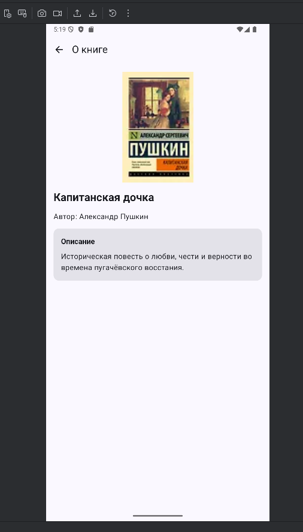
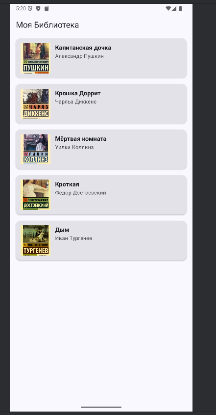
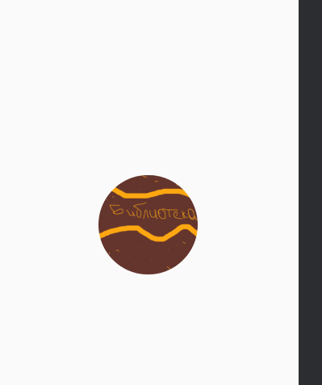

# Моя Библиотека

Простое Android-приложение на Jetpack Compose, реализующее каталог книг с возможностью просмотра списка и детальной информации о каждой книге. Приложение демонстрирует базовые принципы разработки многоэкранных приложений с использованием Navigation Compose, ленивых списков (`LazyColumn`) и архитектурного разделения кода (model, data, ui, navigation).

---

## Описание

Приложение позволяет пользователю:
- Просматривать список из 5 книг с обложками, названиями и авторами;
- Переходить к экрану детального просмотра книги (название, автор, описание);
- Использовать адаптивную иконку приложения в стилистике «библиотеки».

Реализовано в соответствии с методическими указаниями лабораторных работ №8 (прокручиваемые списки) и №15–16 (навигация в Jetpack Compose).

---

## Функциональность

- ✅ Прокручиваемый список книг через `LazyColumn`
- ✅ Карточка книги (`BookCard`) с изображением, названием и автором
- ✅ Экран деталей книги с полным описанием
- ✅ Навигация между экранами через `NavController` и `NavHost`
- ✅ Передача данных между экранами (ID книги → `bookIndex`)
- ✅ Собственная адаптивная иконка приложения (`ic_launcher_foreground.png` + `ic_launcher_background.png`)
- ✅ Поддержка Material 3 Design (Scaffold, Card, TopAppBar, etc.)

---

## Технологии

- 🧠 **Kotlin** — язык программирования
- 🎨 **Jetpack Compose** — декларативный UI-фреймворк
- 🧭 **Navigation Compose** (`androidx.navigation:navigation-compose:2.7.6`) — управление навигацией
- 📦 **Android SDK** — API 25+ (Android 7.0+)
- 🖼️ **Drawable Resources** — обложки книг в `res/drawable/`
- 🌐 **Strings.xml** — локализованные строки (названия, описания, авторы)

---

## Скриншоты

| Главный экран (список книг)      | Экран деталей книги                 | Иконка                    |
|----------------------------------|-------------------------------------|---------------------------|
|  |  |  |


---

## Структура проекта
app/
├── src/main/

│ ├── java/com/ryckluk/mylibrary/

│ │ ├── model/ # Data class Book

│ │ ├── data/ # BookDataSource

│ │ ├── navigation/ # Screen sealed class, NavGraph

│ │ ├── ui_model/ # HomeScreen.kt, DetailsScreen.kt

│ │ └── MainActivity.kt

│ ├── res/

│ │ ├── drawable/ # Обложки книг (book1.jpg, ...)

│ │ ├── values/

│ │ │ ├── strings.xml # Названия, описания, авторы

│ │ │ └── colors.xml, themes.xml

│ │ └── mipmap-* # Иконки (сгенерированы через Image Asset)

│ └── AndroidManifest.xml

└── build.gradle.kts (Module: app)


---

## Как запустить

1. Откройте проект в **Android Studio** (версия ≥ 2023.1).
2. Убедитесь, что подключён эмулятор (API 25+) или физическое устройство.
3. В терминале выполните:
   ```bash
   ./gradlew clean assembleDebug
   ```
4. Нажмите ▶️ **Run 'app'** (зелёная кнопка «Play»).
5. Приложение установится и запустится

## Автор 
- **Автор:** Рыхлюк Надежда 
